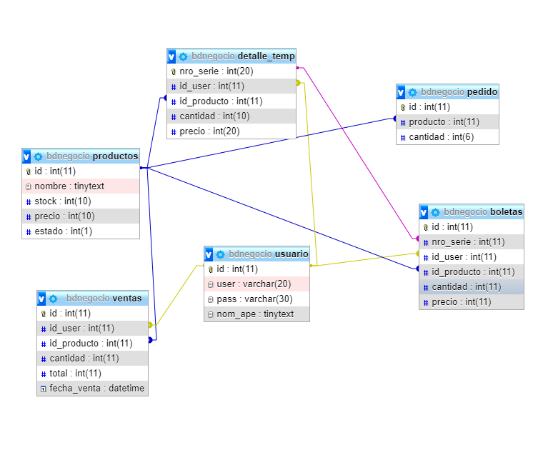

# Proyecto Base de datos
## Proyecto tienda en proceso de automatizacion 

- Integrantes: Esteban Barrera Pino, Vania Suarez Betancur

- Negocio de barrio que se automatizara para pasar de algo totalmente manual con libros y cuadernos para anotar a un sistema en el que se llevara el registro de las finanzas, lo vendido, la mercancia comprada, la mercancia que hay que comprar, etc....

